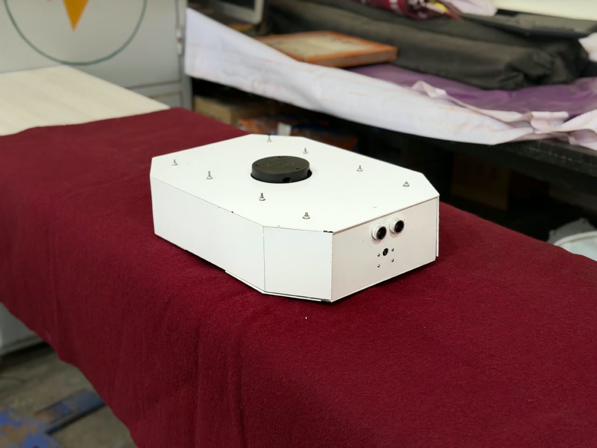
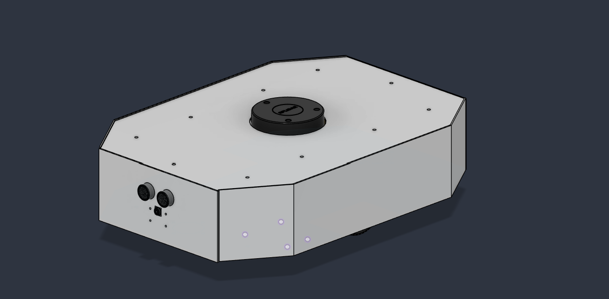
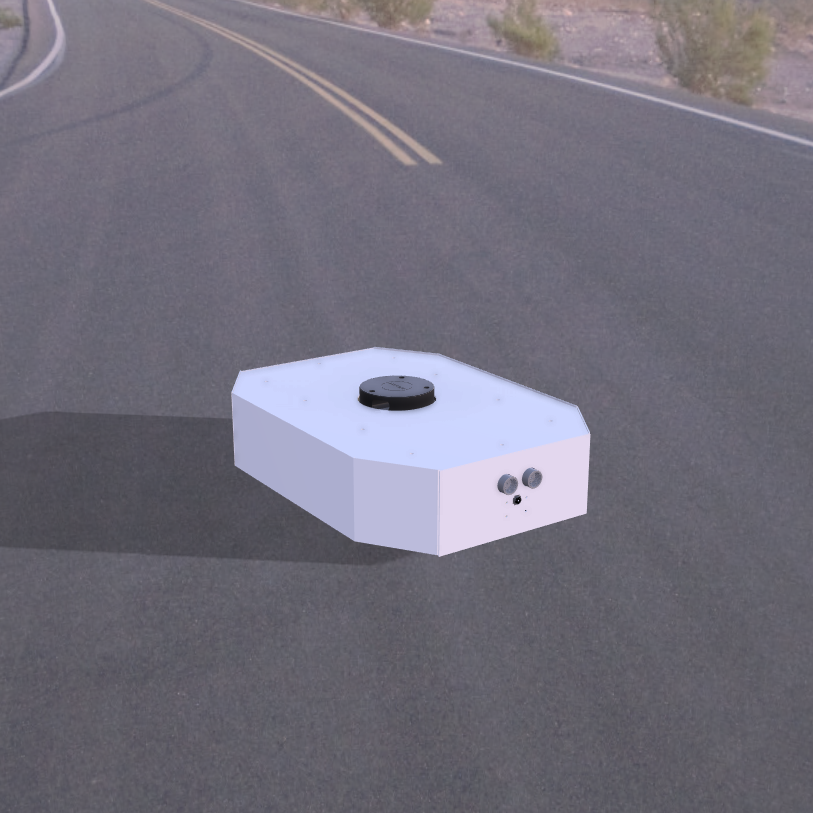

Benzene 🤖

An Autonomous Differential-Drive Mobile Robot

A final-year engineering project combining ROS 2, embedded systems, mechanical design, and autonomous navigation.

  

  <a href="https://github.com/attu0/benzene">GitHub Repository</a>
  &nbsp;•&nbsp;
  <a href="https://drive.google.com/file/d/1qdtDz3HJxDPnA_4TYmKJY9449RnS3Dy-/view?usp=sharing">Robot Demonstration Video</a>

📌 Table of Contents

About Benzene

Key Features

Robot Design

System Architecture

Hardware

Circuit and Deployment Diagrams

Software Stack

Package Overview

Requirements

Installation

Building the Workspace

Running the Simulation

SLAM and Autonomous Navigation

Physical Robot Setup

Project Structure

Future Development

Team and Acknowledgements

Contributing

License

🤖 About Benzene

Benzene is an autonomous differential-drive mobile robot developed by undergraduate students as a final-year engineering project at Rajarambapu Institute of Technology (RIT), Rajaramnagar, with support from Taikisha Engineering India Ltd.

The project brings together mechanical design and fabrication, embedded control, sensor integration, and robotics software. Its modular ROS 2 architecture is designed to support development in simulation and testing on the physical robot.

The long-term goal is to build a flexible mobile robotics platform that can perceive its surroundings, estimate its position, map an environment, and navigate toward target locations.

ROS 2: Jazzy
Primary OS: Ubuntu 24.04 LTS
Robot Type: Differential drive
Simulation: Gazebo
Visualisation: RViz2
Repository: attu0/benzene

🚀 Key Features

Differential-drive motion: Two driven wheels provide forward, reverse, and turning motion.

Modular ROS 2 architecture: Separate packages for description, control, hardware, sensors, simulation, localisation, and navigation.

Robot description: URDF/Xacro-based model resources for robot representation and visualisation.

Gazebo simulation: Test robot behaviour in virtual environments before physical trials.

SLAM: Build a map of an environment while estimating the robot's pose, using the configured SLAM Toolbox workflow.

Autonomous navigation: Nav2-based navigation using a map, localisation, planning, and obstacle-aware control.

Sensor integration: Interfaces for components such as LiDAR, IMU, camera, and ultrasonic sensors, depending on the active configuration.

Hardware integration: Communication between the onboard computer, embedded controller, and drive system.

Simulation-to-reality workflow: A shared ROS 2 software structure for simulation and physical-robot development.

Feature availability depends on the packages, hardware, launch files, and configuration in the current branch. Check the relevant package before assuming a feature is enabled.

🛠️ Robot Design

The chassis was designed for a compact differential-drive mobile robot. The mechanical design and fabricated prototype provide the platform for integrating the onboard computer, motor controller, sensors, and power system.

  

CAD model designed in Fusion 360.

Physical prototype

  

If the physical robot photograph is stored under a different filename, update the image path above to match the repository.

🏗️ System Architecture

Benzene uses ROS 2 as the communication layer between sensing, control, localisation, and navigation components.

                       ┌───────────────────────────┐
                       │        ROS 2 Jazzy        │
                       │    Robot Applications     │
                       └─────────────┬─────────────┘
                                     │
                 ┌───────────────────┼───────────────────┐
                 │                   │                   │
                 ▼                   ▼                   ▼
          ┌────────────┐      ┌──────────────┐    ┌────────────┐
          │   Control  │      │ Localisation │    │ Navigation │
          │ros2_control│      │   EKF / TF   │    │    Nav2    │
          └─────┬──────┘      └──────▲───────┘    └─────┬──────┘
                │                    │                  │
                ▼                    │                  ▼
          ┌──────────────────────────────────────────────────┐
          │                   Robot Hardware                 │
          │ Motors │ Encoders │ IMU │ LiDAR │ Other Sensors  │
          └──────────────────────────────────────────────────┘

The architecture supports two intended operating modes:

Simulation: The robot model, sensors, and environment run in Gazebo.

Physical robot: ROS 2 communicates with the robot hardware through the relevant hardware interface and embedded controller.

The diagram is conceptual; exact nodes, topics, transforms, and interfaces depend on the launch configuration.

🔌 Hardware

The physical platform is built around the following component categories:

Subsystem

Component / role

Mobile base

Differential-drive chassis

Main computer

Raspberry Pi single-board computer

Microcontroller

Arduino Uno R3

Drive system

Two geared DC motors

Motor control

Dual-channel motor driver

Feedback

Wheel encoders, where configured

Range sensing

2D LiDAR

Inertial sensing

IMU

Proximity sensing

Ultrasonic sensor

Power

Battery pack and regulated DC supply

Mechanical structure

Designed chassis and fabricated body panels

The exact component models, pin assignments, and wiring should be checked against the current hardware build before assembly or testing.

🔧 Circuit and Deployment Diagrams

Electrical circuit / wiring diagram

  

This diagram should show the electrical connections between the battery, voltage regulation, motor driver, microcontroller, onboard computer, and sensors. Verify that it matches the physical robot revision before using it for wiring.

Hardware and software deployment diagram

  

The deployment diagram describes where the main ROS 2 components run and how sensor data and motor commands move between the onboard computer, embedded controller, and robot hardware.

Image paths: The circuit and deployment images are expected at the paths shown above. If your committed images have different filenames or folders, update the src paths accordingly.

💻 Software Stack

Technology

Purpose

ROS 2 Jazzy

Robotics middleware and package framework

Ubuntu 24.04 LTS

Primary development platform

URDF / Xacro

Robot model description

Gazebo

Simulation

RViz2

Visualisation of the robot, transforms, sensors, and maps

ros2_control

Robot control framework, where configured

EKF

Sensor fusion and state estimation, where configured

SLAM Toolbox

Mapping

Nav2

Autonomous navigation

colcon

Workspace build system

rosdep

Dependency management

📦 Package Overview

The repository is organised into modular ROS 2 packages.

Package

Purpose

benzene_arduino

Embedded controller code and hardware testing utilities

benzene_bringup

Launch files and scripts for starting robot components

benzene_camera

Camera integration

benzene_control

Controller configuration

benzene_dagger

Behavioural cloning and imitation-learning development

benzene_description

URDF/Xacro descriptions and model resources

benzene_docking

Docking-related functionality

benzene_explore

Autonomous exploration functionality

benzene_explore_msgs

Exploration-related custom interfaces

benzene_gazebo

Simulation launch files, worlds, models, and resources

benzene_hardware

Hardware interface

benzene_imu

IMU integration

benzene_localization

Localisation and sensor-fusion configuration

benzene_msgs

Custom ROS 2 interfaces

benzene_navigation

SLAM, Nav2 configuration, maps, and navigation launch files

benzene_serial

Serial communication support

benzene_system_tests

System-level testing utilities

benzene_ultrasonic

Ultrasonic sensor integration

docker

Docker configuration for supported workflows

Package directories and optional components can change during development. Refer to the current repository for the complete list.

🛠️ Requirements

Software

Ubuntu 24.04 LTS

ROS 2 Jazzy

colcon

rosdep

Git

Gazebo and RViz2 for simulation and visualisation

Nav2 and SLAM Toolbox for the configured navigation workflow

Hardware

For physical-robot operation, the platform may require:

Differential-drive chassis and two geared DC motors

Motor driver and embedded controller

Onboard Linux computer

Wheel encoders, if used for odometry

IMU and LiDAR

Battery and voltage regulation

Additional sensors supported by the active configuration

📥 Installation

1. Create a workspace

mkdir -p ~/ros2_ws/src
cd ~/ros2_ws/src

2. Clone the repository

git clone https://github.com/attu0/benzene.git
cd benzene

3. Install build and dependency tools

Ensure ROS 2 Jazzy is installed using the official ROS 2 installation guide.

sudo apt update
sudo apt install python3-rosdep python3-colcon-common-extensions

Initialise rosdep if it has not already been initialised:

sudo rosdep init
rosdep update

If rosdep is already initialised, run only:

rosdep update

4. Install repository dependencies

cd ~/ros2_ws
source /opt/ros/jazzy/setup.bash

rosdep install \
  --from-paths src \
  --ignore-src \
  --rosdistro jazzy \
  -r -y

The repository also contains a requirements.sh helper script. Review the script before running it, then follow its instructions if you prefer that setup workflow.

🔨 Building the Workspace

Build all packages:

cd ~/ros2_ws
source /opt/ros/jazzy/setup.bash
colcon build --symlink-install

Build a specific package and its dependencies:

colcon build --symlink-install --packages-up-to benzene_bringup

Source the workspace:

source ~/ros2_ws/install/setup.bash

To source ROS 2 and the workspace automatically in new Bash terminals, add these lines to ~/.bashrc:

source /opt/ros/jazzy/setup.bash
source ~/ros2_ws/install/setup.bash

Reload the configuration:

source ~/.bashrc

Verify that ROS 2 can discover the packages:

ros2 pkg list | grep benzene

🌎 Running the Simulation

Benzene includes Gazebo simulation resources for testing robot behaviour in virtual environments.

1. Source the environment

source /opt/ros/jazzy/setup.bash
source ~/ros2_ws/install/setup.bash

2. Launch the Gazebo robot

The repository includes a Gazebo launch file. The following example uses a warehouse world and enables RViz2:

ros2 launch benzene_gazebo benzene.gazebo.launch.py \
  enable_odom_tf:=true \
  headless:=False \
  load_controllers:=true \
  world_file:=warehouse.sdf \
  use_rviz:=true \
  use_robot_state_pub:=true \
  use_sim_time:=true \
  x:=0.0 y:=0.0 z:=0.20 \
  roll:=0.0 pitch:=0.0 yaw:=0.0

Launch arguments and world filenames can change between branches. If this command does not match the current launch file, inspect its supported arguments first.

🗺️ SLAM and Autonomous Navigation

Benzene uses SLAM Toolbox and Nav2 in the configured mapping and navigation workflow.

Launch navigation in simulation

ros2 launch benzene_bringup benzene_navigation.launch.py \
  enable_odom_tf:=false \
  headless:=False \
  load_controllers:=true \
  slam:=True \
  use_rviz:=true \
  use_robot_state_pub:=true \
  use_sim_time:=true \
  x:=0.0 y:=0.0 z:=0.20 \
  roll:=0.0 pitch:=0.0 yaw:=0.0 \
  world_file:=cafe.world \
  sim:=true

Note: Confirm that the launch file supports these arguments and that the specified world file exists in the current branch. Launch argument names may vary.

Mapping a new environment

Start the simulation or bring up the physical robot.

Confirm that LiDAR scan data is being published.

Verify odometry and the TF tree.

Start SLAM Toolbox using the available launch configuration.

Move the robot through the environment.

Monitor the map in RViz2.

Save the map when mapping is complete.

ros2 run nav2_map_server map_saver_cli -f ~/benzene_map

This saves the map to files such as benzene_map.yaml and benzene_map.pgm.

Navigate using a saved map

Configure the navigation stack to load the saved map and start the appropriate localisation workflow. In RViz2, set the initial pose when required, send a navigation goal, and monitor the robot's progress.

🖥️ Helper Scripts

The repository provides helper scripts for common launch workflows.

Make the scripts executable:

chmod +x ~/ros2_ws/src/benzene/benzene_bringup/scripts/*

Launch the Gazebo simulation:

~/ros2_ws/src/benzene/benzene_bringup/scripts/benzene_gazebo.sh

Launch the navigation workflow:

~/ros2_ws/src/benzene/benzene_bringup/scripts/benzene_navigation.sh

Check each script's argument-handling code before passing optional arguments such as a world name or SLAM mode.

🔌 Physical Robot Setup

The physical-robot workflow connects the motors, encoders, and sensors to ROS 2 through the relevant hardware interface and embedded controller.

Secure the robot and keep the drive wheels clear of the floor for initial motor tests.

Check battery voltage, regulator output, polarity, and common ground.

Confirm the embedded firmware and motor-driver wiring.

Configure the serial device and communication parameters.

Start the hardware interface and sensor drivers.

Verify encoder odometry, IMU data, LiDAR data, and TF transforms.

Start localisation and navigation only after the underlying data is valid.

Test at low speed in a clear area before autonomous operation.

Useful diagnostic commands:

ros2 topic list
ros2 topic info /cmd_vel
ros2 topic echo /odom
ros2 topic echo /imu/data
ros2 topic echo /scan

Topic names depend on the active configuration.

Safety: Check motor direction, emergency-stop behaviour, wiring polarity, regulator voltage, and motor-driver current limits before operation. Keep hands, clothing, and loose cables away from wheels and moving parts.

📁 Project Structure

benzene/
├── assets/
│   └── images/
│       └── benzene/
│           └── fusion.png
├── benzene_arduino/
├── benzene_bringup/
│   ├── launch/
│   └── scripts/
├── benzene_camera/
├── benzene_control/
├── benzene_dagger/
├── benzene_description/
├── benzene_docking/
├── benzene_explore/
├── benzene_explore_msgs/
├── benzene_gazebo/
│   ├── launch/
│   ├── models/
│   └── worlds/
├── benzene_hardware/
├── benzene_imu/
├── benzene_localization/
├── benzene_msgs/
├── benzene_navigation/
│   ├── config/
│   ├── launch/
│   └── maps/
├── benzene_serial/
├── benzene_system_tests/
├── benzene_ultrasonic/
├── docs/
│   └── images/
├── docker/
└── README.md

This is a high-level overview; the repository may contain additional files and directories.

🔬 Future Development

Potential areas for continued development include:

Improving wheel odometry and sensor-fusion accuracy.

More robust autonomous exploration.

Improved obstacle detection and avoidance.

Camera-based perception and visual navigation.

Battery monitoring and power-management integration.

Automated docking and charging.

Imitation learning and behavioural cloning.

DAgger-based data collection and policy improvement.

Expanded simulation testing and hardware validation.

Improved system-level testing and deployment tools.

👥 Team and Acknowledgements

Developed as a final-year B.Tech Mechatronics Engineering capstone project at Rajarambapu Institute of Technology (RIT), Rajaramnagar, with support from Taikisha Engineering India Ltd.

Team members

Atharv Mahesh Mudse

Riddhi Anirudha Wagh

Abhay Ajit Potdar

Tushar Kailash Jadhav

Project guide: Prof. Shital A. Lavte

We acknowledge the support and guidance that helped us develop the mechanical prototype and robotics software.

🤝 Contributing

Contributions, bug reports, and suggestions are welcome.

Fork the repository.

Create a feature branch.

Implement and test your changes.

Build the affected ROS 2 packages.

Submit a pull request describing your changes.

git clone https://github.com/attu0/benzene.git
cd benzene
git checkout -b feature/your-feature

📄 License

Refer to the LICENSE file for the project's licensing terms.

Benzene — Autonomous Differential-Drive Robotics Platform

ROS 2 · SLAM · Nav2 · Gazebo · Sensor Fusion · Embedded Systems

Repository · Robot Demonstration Video

