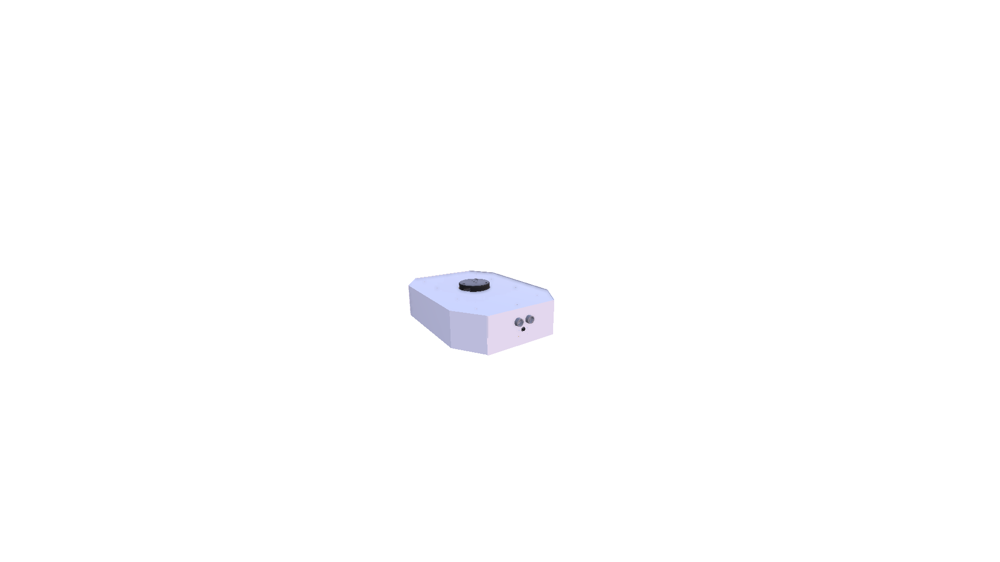
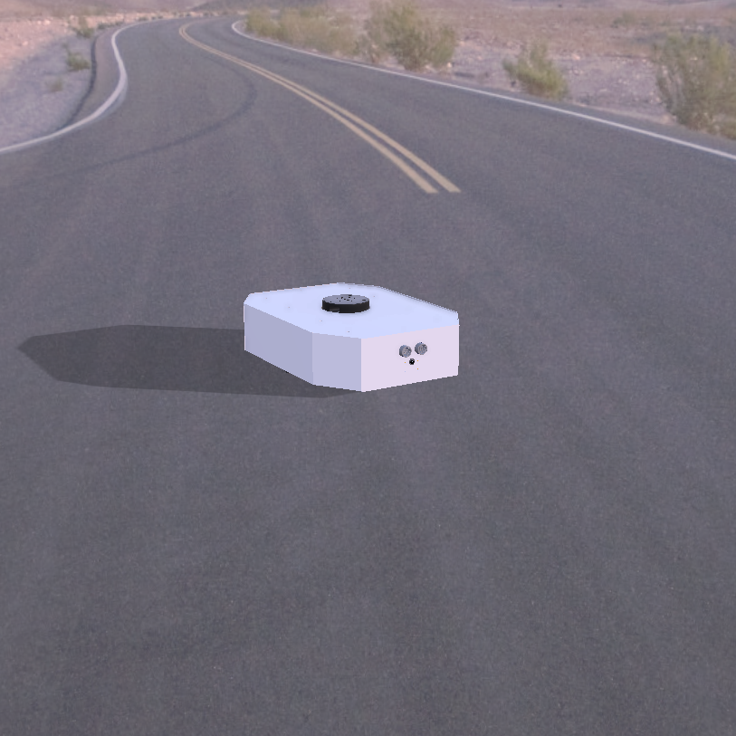
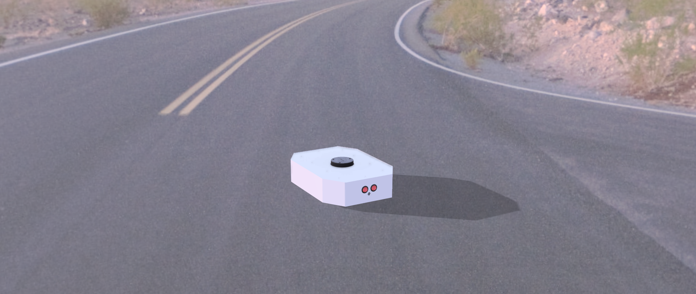

Benzene 🤖

ROS 2–Based Autonomous Mobile Robot for Indoor Navigation

A differential-drive Autonomous Mobile Robot (AMR) developed at Rajarambapu Institute of Technology, with support from Taikisha Engineering India Ltd.

  

  

Table of Contents

About the Project

Highlights

Robot Gallery

System Architecture

Hardware

Circuit and Deployment Diagrams

Videos and Demonstrations

Software Stack

Repository Structure

Getting Started

Build the Workspace

Simulation and Navigation

Running on the Physical Robot

Team and Acknowledgements

Contributing

License

About the Project

Benzene is an autonomous mobile robot developed as a final-year B.Tech Mechatronics Engineering capstone project at Rajarambapu Institute of Technology (RIT), Rajaramnagar. The project explores indoor autonomous navigation using ROS 2, a differential-drive platform, onboard sensors, mapping and path planning. The chassis was designed and fabricated by the project team, and the project was supported by Taikisha Engineering India Ltd.

The goal is to develop a flexible mobile robot that can perceive its surroundings, build or use a map, estimate its position, and navigate toward goals without depending on fixed floor tracks.

The repository contains ROS 2 packages for robot description, embedded control, hardware integration, simulation, localisation, navigation and exploration. Where supported by the relevant configuration, the software architecture is intended to be used in simulation and on the physical robot.

Highlights

Differential-drive mobile base with two driven wheels.

ROS 2 Jazzy software stack.

Robot description using URDF/Xacro and visualisation in RViz2.

Gazebo simulation for testing the robot and environments.

SLAM and localisation for mapping and pose estimation.

Nav2 navigation for goal-directed movement and obstacle-aware planning.

Embedded hardware integration between the onboard computer, microcontroller and motor driver.

CAD-to-hardware workflow, from model design to a fabricated prototype.

Feature availability depends on the packages, launch files, sensors and configuration in the checked-out branch. Review the relevant package documentation before running a feature on hardware.

Robot Gallery

CAD and rendered model

  
  

Fabricated robot

  

If you use a different filename for the physical-robot photograph, update the image path above to match the file committed to the repository.

System Architecture

The intended data flow is:

┌────────────────────────────────────────────────────┐
│ Sensors                                            │
│ LiDAR / IMU / wheel encoders / camera / ultrasonic │
└──────────────────────┬─────────────────────────────┘
                       │ sensor data
┌──────────────────────▼─────────────────────────────┐
│ Hardware interface and embedded controller         │
│ ROS 2 drivers / serial communication / motor driver│
└──────────────────────┬─────────────────────────────┘
                       │ odometry and sensor topics
┌──────────────────────▼─────────────────────────────┐
│ State estimation and mapping                       │
│ Robot odometry / sensor fusion / SLAM              │
└──────────────────────┬─────────────────────────────┘
                       │ map and robot pose
┌──────────────────────▼─────────────────────────────┐
│ Navigation                                          │
│ Nav2 planners / costmaps / local controller        │
└──────────────────────┬─────────────────────────────┘
                       │ velocity commands
┌──────────────────────▼─────────────────────────────┐
│ Differential-drive base                            │
│ Motor driver → left and right wheels               │
└────────────────────────────────────────────────────┘

The diagram is a conceptual overview. Exact topics, drivers and active components depend on the launch configuration.

Hardware

The report and project configuration describe a platform built around these component categories:

Subsystem

Component / role

Mobile base

Differential-drive chassis

Main computer

Raspberry Pi single-board computer

Microcontroller

Arduino Uno R3

Motor driver

Dual-channel motor driver

Drive

Two geared DC motors; encoder feedback where configured

Range sensing

2D LiDAR

Inertial sensing

IMU

Proximity sensing

Ultrasonic sensor

Power

Battery pack and regulated DC supply

Mechanical structure

Designed chassis and fabricated body panels

Check the current hardware bill of materials and wiring before purchasing or connecting parts. Component models and pin assignments can differ between prototype revisions.

Circuit and Deployment Diagrams

Electrical wiring / circuit diagram

  

The circuit diagram should document the connections among the battery, power regulation, motor driver, microcontroller, main computer and sensors. Confirm that the image matches the actual hardware revision before using it for assembly.

Deployment diagram

  

The deployment diagram should show which components run on the onboard computer, which functions run on the microcontroller, and how sensor data and motor commands pass between them.

Image paths: The two diagram paths above are suggested locations. Add the corresponding image files to docs/images/ with these names, or change the Markdown paths to match your actual filenames.

Videos and Demonstrations

GitHub README files can display videos using links hosted on GitHub, YouTube or another accessible video host. Upload the videos first, then replace the placeholders below with the resulting URLs.

Robot demonstration

[Watch on Google Drive](https://drive.google.com/file/d/1qdtDz3HJxDPnA_4TYmKJY9449RnS3Dy-/view?usp=sharing)

Watch the CAD model walkthrough

Suggested video content

Physical robot overview and hardware layout.

CAD model rotation and important mechanical features.

Circuit and power distribution walkthrough.

Gazebo simulation and RViz2 visualisation.

SLAM map creation and Nav2 goal navigation.

Software Stack

Technology

Purpose

ROS 2 Jazzy

Robotics middleware and package framework

Ubuntu 24.04 LTS

Intended development platform for Jazzy

URDF / Xacro

Robot model description

Gazebo

Robot and environment simulation

RViz2

Robot, sensor, TF and map visualisation

ros2_control

Hardware abstraction and motion control, where configured

SLAM Toolbox

Mapping, where configured

Nav2

Autonomous navigation, where configured

colcon

Workspace build tool

rosdep

ROS dependency installation

Repository Structure

The repository is organised into ROS 2 packages. The main areas include:

benzene/
├── assets/
│   └── images/
│       └── benzene/          # Rendered and CAD model images
├── benzene_arduino/          # Microcontroller code and utilities
├── benzene_bringup/          # Launch files and robot startup
├── benzene_camera/           # Camera integration
├── benzene_control/          # Controller configuration
├── benzene_description/      # URDF/Xacro and robot description
├── benzene_gazebo/           # Simulation models, worlds and launch files
├── benzene_hardware/         # Hardware interface
├── benzene_imu/              # IMU integration
├── benzene_localization/     # Localisation configuration
├── benzene_navigation/       # SLAM, Nav2, maps and navigation launch files
├── benzene_serial/           # Serial communication
├── benzene_ultrasonic/       # Ultrasonic sensor integration
├── docs/
│   └── images/               # Project photos and diagrams
├── requirements.sh
└── README.md

This is a high-level overview; package names and contents may vary by branch.

Getting Started

Requirements

Ubuntu 24.04 LTS

ROS 2 Jazzy

colcon and rosdep

Git and an internet connection

Install ROS 2 Jazzy using the official ROS 2 installation guide.

Clone the repository

Create a workspace and clone the project into src:

mkdir -p ~/ros2_ws/src
cd ~/ros2_ws/src
git clone https://github.com/attu0/benzene.git
cd benzene

Install dependencies

sudo apt update
sudo apt install python3-rosdep python3-colcon-common-extensions

# Run this only if rosdep has not already been initialized.
sudo rosdep init
rosdep update

cd ~/ros2_ws
source /opt/ros/jazzy/setup.bash
rosdep install --from-paths src --ignore-src --rosdistro jazzy -r -y

If rosdep init reports that it has already been initialized, continue with rosdep update.

Build the Workspace

cd ~/ros2_ws
source /opt/ros/jazzy/setup.bash
colcon build --symlink-install
source install/setup.bash

To build a specific package and its dependencies:

colcon build --symlink-install --packages-up-to benzene_bringup

Check that packages are discoverable:

ros2 pkg list | grep benzene

Simulation and Navigation

Launch commands can change as the project develops. Check the launch files and their declared arguments in the branch you are using before running them.

Gazebo simulation

The repository README and launch files should be treated as the source of truth for the current world name and launch arguments. A typical workflow is:

Source ROS 2 and the built workspace.

Launch the robot model and selected Gazebo world using the available benzene_gazebo launch file.

Open RViz2 if it is not launched automatically.

Verify the robot model, transforms and sensor topics.

source /opt/ros/jazzy/setup.bash
source ~/ros2_ws/install/setup.bash
ros2 launch benzene_gazebo benzene.gazebo.launch.py --show-args

Use the arguments shown by the command to construct the launch command for your chosen world and configuration.

SLAM and navigation

Before starting SLAM or Nav2, verify that the expected sensor and transform topics are active:

ros2 topic list
ros2 topic echo /scan
ros2 topic echo /odom
ros2 run tf2_tools view_frames

If the active setup uses SLAM Toolbox and Nav2, the general workflow is:

Start the simulation or bring up the physical robot.

Confirm LiDAR data, odometry and the TF tree are valid.

Start SLAM and visualise the map in RViz2.

Save a completed map with the Nav2 map saver.

Configure localisation on the saved map and send a navigation goal.

ros2 run nav2_map_server map_saver_cli -f ~/benzene_map

Use the package-specific launch files and configuration from your checked-out branch; the command above only saves a map and does not launch SLAM or Nav2 by itself.

Running on the Physical Robot

Secure the robot and raise the driven wheels for initial motor tests.

Check battery voltage, regulator output, polarity and common ground.

Confirm the microcontroller firmware and motor-driver wiring.

Connect the onboard computer and configure any serial device required by the hardware interface.

Start the sensor drivers and verify their topics.

Check odometry and transforms before enabling navigation.

Test at low speed in a clear area before attempting autonomous operation.

Useful diagnostic commands:

ros2 topic list
ros2 topic info /cmd_vel
ros2 topic echo /odom
ros2 topic echo /scan
ros2 topic echo /imu/data

Safety: Verify battery polarity, regulator voltage, motor-driver current limits, emergency-stop behaviour and motor direction before operating the robot. Keep hands and loose cables away from wheels and moving parts.

Team and Acknowledgements

Developed as a final-year B.Tech Mechatronics Engineering capstone project at Rajarambapu Institute of Technology (RIT), Rajaramnagar, with support from Taikisha Engineering India Ltd.

Team

Atharv Mahesh Mudse

Riddhi Anirudha Wagh

Abhay Ajit Potdar

Tushar Kailash Jadhav

Project guide: Prof. Shital A. Lavte

Contributing

Contributions, bug reports and suggestions are welcome.

Fork the repository.

Create a branch for your changes.

Make and test your changes.

Commit the work with a clear message.

Open a Pull Request describing the changes and any testing performed.

License

See the LICENSE file for the project's license terms.