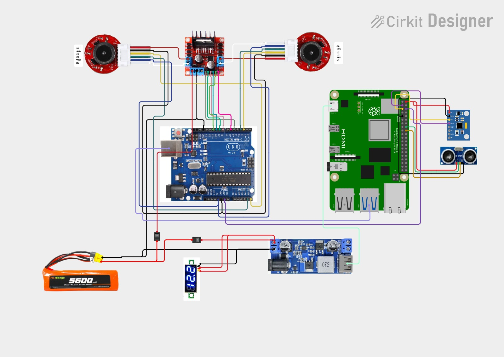
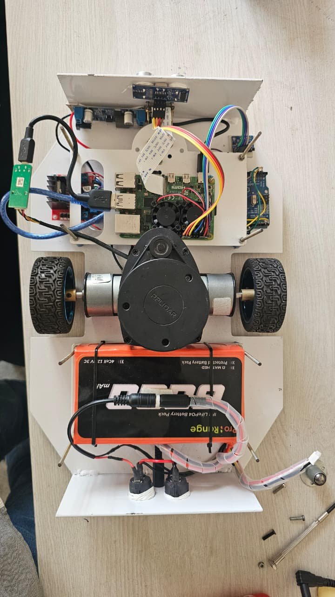

<div align="center">

# 🤖 Benzene
### An Autonomous Differential-Drive Mobile Robot

**A ROS 2-based autonomous mobile robot developed at Rajarambapu Institute of Technology (RIT), with support from Taikisha Engineering India Ltd.**


<p>
  <a href="https://github.com/attu0/benzene">📦 GitHub Repository</a> •
  <a href="https://drive.google.com/file/d/1qdtDz3HJxDPnA_4TYmKJY9449RnS3Dy-/view?usp=sharing">🎥 Robot Demonstration</a>
</p>

</div>

---

## 📌 Table of Contents

- [🤖 About the Project](#-about-the-project)
- [✨ Key Features](#-key-features)
- [🛠️ CAD Design and Physical Robot](#️-cad-design-and-physical-robot)
- [🏗️ System Architecture](#️-system-architecture)
- [🔌 Hardware Components](#-hardware-components)
- [📐 Circuit and Deployment Diagrams](#-circuit-and-deployment-diagrams)
- [💻 Software Stack](#-software-stack)
- [📦 ROS 2 Packages](#-ros-2-packages)
- [⚙️ Installation and Setup](#️-installation-and-setup)
- [🔨 Build the Workspace](#-build-the-workspace)
- [🌎 Run the Simulation](#-run-the-simulation)
- [🗺️ SLAM and Autonomous Navigation](#️-slam-and-autonomous-navigation)
- [🤖 Run on the Physical Robot](#-run-on-the-physical-robot)
- [📁 Repository Structure](#-repository-structure)
- [🚀 Future Improvements](#-future-improvements)
- [👥 Team and Acknowledgements](#-team-and-acknowledgements)
- [🤝 Contributing](#-contributing)
- [📄 License](#-license)

---

## 🤖 About the Project

**Benzene** is an autonomous differential-drive mobile robot developed as a final-year engineering project at **Rajarambapu Institute of Technology (RIT), Rajaramnagar**, with support from **Taikisha Engineering India Ltd.**

The project combines mechanical design, embedded systems, sensor integration, and robotics software to develop a mobile platform capable of navigating its environment.

The software architecture uses ROS 2 to connect robot hardware, sensor drivers, motion control, localisation, mapping, and navigation components. Gazebo and RViz2 support simulation, visualisation, and testing during development.

### 📋 Project Overview

| Specification | Details |
|---|---|
| **Robot Type** | Differential-drive mobile robot |
| **Robotics Middleware** | ROS 2 Jazzy |
| **Operating System** | Ubuntu 24.04 LTS |
| **Robot Modelling** | URDF / Xacro |
| **Simulation** | Gazebo |
| **Visualisation** | RViz2 |
| **Mapping** | SLAM Toolbox |
| **Navigation** | Nav2 |
| **Repository** | [attu0/benzene](https://github.com/attu0/benzene) |

---

## ✨ Key Features

- **Differential-Drive Control** — Independent left and right wheel control for forward, reverse, and turning motion.
- **ROS 2 Architecture** — Modular packages for robot description, control, hardware, sensors, and navigation.
- **Robot Modelling** — URDF/Xacro-based robot description for visualisation and simulation.
- **Gazebo Simulation** — Test robot behaviour in virtual environments.
- **SLAM** — Map an environment while estimating the robot's position.
- **Autonomous Navigation** — Nav2-based path planning and goal-directed navigation.
- **Sensor Integration** — Interfaces for LiDAR, IMU, camera, and ultrasonic sensing, depending on the active configuration.
- **Hardware Integration** — Communication between the onboard computer, embedded controller, and drive system.

> **Note:** Feature availability depends on the hardware, packages, launch files, and configuration in the current repository branch.

---

## 🛠️ CAD Design and Physical Robot

The robot chassis was designed to provide a compact platform for the drive system, onboard computer, sensors, and power electronics.

### 🧩 CAD Model

<p align="center">
  
</p>

<p align="center"><em>CAD model of the Benzene mobile robot.</em></p>

### 🤖 Physical Prototype

<p align="center">
  
</p>

<p align="center"><em>Rendered view of the Benzene mobile robot.</em></p>

🎥 **[Watch the Robot Demonstration](https://drive.google.com/file/d/1qdtDz3HJxDPnA_4TYmKJY9449RnS3Dy-/view?usp=sharing)**

---

## 🏗️ System Architecture

The system architecture connects the sensing, control, localisation, and navigation components through ROS 2.

```text
                 ┌───────────────────────────┐
                 │         ROS 2 Jazzy       │
                 │    Robotics Middleware    │
                 └─────────────┬─────────────┘
                               │
              ┌────────────────┼────────────────┐
              │                │                │
              ▼                ▼                ▼
       ┌─────────────┐  ┌─────────────┐  ┌─────────────┐
       │   Control   │  │ Localisation│  │ Navigation  │
       │ Motor Cmds  │  │  Odometry   │  │    Nav2     │
       └──────┬──────┘  └──────▲──────┘  └──────┬──────┘
              │                │                │
              ▼                │                ▼
       ┌─────────────────────────────────────────────┐
       │                Robot Hardware               │
       │ Motors │ Encoders │ IMU │ LiDAR │ Sensors  │
       └─────────────────────────────────────────────┘
```

### Operating Modes

| Mode | Description |
|---|---|
| **Simulation** | Robot model and simulated environment run in Gazebo. |
| **Physical Robot** | ROS 2 communicates with the robot hardware through the configured hardware interfaces. |

> The architecture is a conceptual overview. Actual nodes, topics, transforms, and interfaces depend on the launch configuration.

---

## 🔌 Hardware Components

The robot integrates mechanical, electrical, and computing components to support mobile robotics development.

| Subsystem | Component |
|---|---|
| Mobile Base | Differential-drive chassis |
| Main Computer | Raspberry Pi |
| Microcontroller | Arduino Uno R3 |
| Drive System | Geared DC motors |
| Motor Control | Dual-channel motor driver |
| Feedback | Wheel encoders, where configured |
| Range Sensing | 2D LiDAR |
| Inertial Sensing | IMU |
| Proximity Sensing | Ultrasonic sensor |
| Power System | Battery and regulated DC supply |
| Mechanical Structure | Designed and fabricated chassis |

*Verify the actual component models, pin assignments, and electrical connections against the current hardware revision before assembly or operation.*

---

## 📐 Circuit and Deployment Diagrams

### 🔋 Electrical Circuit Diagram

<p align="center">
  
</p>

The circuit diagram illustrates the electrical connections between the power supply, voltage regulation, motor driver, microcontroller, onboard computer, and sensors.

### 🖥️ Hardware Deployment Diagram

<p align="center">
  
</p>

The deployment diagram provides a view of the robot's internal hardware layout and component placement.

---

## 💻 Software Stack

| Technology | Purpose |
|---|---|
| **ROS 2 Jazzy** | Robotics middleware |
| **Ubuntu 24.04 LTS** | Development operating system |
| **URDF / Xacro** | Robot description |
| **Gazebo** | Simulation |
| **RViz2** | Robot and sensor visualisation |
| **ros2_control** | Hardware and motion control, where configured |
| **EKF** | Sensor fusion and state estimation, where configured |
| **SLAM Toolbox** | Mapping |
| **Nav2** | Autonomous navigation |
| **colcon** | Workspace build system |
| **rosdep** | Dependency management |

---

## 📦 ROS 2 Packages

The repository follows a modular package structure.

| Package | Purpose |
|---|---|
| `benzene_arduino` | Embedded controller code and hardware testing |
| `benzene_bringup` | Robot launch files and startup configuration |
| `benzene_camera` | Camera integration |
| `benzene_control` | Controller configuration |
| `benzene_dagger` | Behavioural cloning and imitation learning |
| `benzene_description` | URDF/Xacro and robot model resources |
| `benzene_docking` | Docking-related functionality |
| `benzene_explore` | Autonomous exploration |
| `benzene_explore_msgs` | Exploration-related interfaces |
| `benzene_gazebo` | Simulation worlds, models, and launch files |
| `benzene_hardware` | Hardware interfaces |
| `benzene_imu` | IMU integration |
| `benzene_localization` | Localisation and sensor fusion |
| `benzene_msgs` | Custom ROS 2 interfaces |
| `benzene_navigation` | SLAM, Nav2, maps, and navigation configuration |
| `benzene_serial` | Serial communication |
| `benzene_system_tests` | System-level testing |
| `benzene_ultrasonic` | Ultrasonic sensor integration |
| `docker` | Docker configuration |

---

## ⚙️ Installation and Setup

### Requirements

**Software**
- Ubuntu 24.04 LTS
- ROS 2 Jazzy
- Git
- `colcon`
- `rosdep`
- Gazebo and RViz2
- Nav2 and SLAM Toolbox for the configured navigation workflow

### 1. Create a Colcon Workspace

```bash
mkdir -p ~/ros2_ws/src
cd ~/ros2_ws/src
```

### 2. Clone the Repository

```bash
git clone https://github.com/attu0/benzene.git
cd benzene
```

### 3. Install Build and Dependency Tools

Install ROS 2 Jazzy by following the [official installation guide](https://docs.ros.org/en/jazzy/Installation/Ubuntu-Install-Debs.html).

```bash
sudo apt update
sudo apt install python3-rosdep python3-colcon-common-extensions
```

Initialise `rosdep` if it has not already been initialised:

```bash
sudo rosdep init
rosdep update
```

If `rosdep` is already initialised, run only:

```bash
rosdep update
```

### 4. Install Repository Dependencies

```bash
cd ~/ros2_ws
source /opt/ros/jazzy/setup.bash

rosdep install \
  --from-paths src \
  --ignore-src \
  --rosdistro jazzy \
  -r -y
```

---

## 🔨 Build the Workspace

Navigate to the workspace root and build the packages:

```bash
cd ~/ros2_ws
source /opt/ros/jazzy/setup.bash
colcon build --symlink-install
```

To build a specific package and its dependencies:

```bash
colcon build --symlink-install --packages-up-to benzene_bringup
```

### Source the Workspace

After a successful build:

```bash
source ~/ros2_ws/install/setup.bash
```

### Automatically Source ROS 2 Using `.bashrc`

To automatically source ROS 2 and your workspace in new terminals, add the following lines to `~/.bashrc`:

```bash
# ROS 2 Jazzy
source /opt/ros/jazzy/setup.bash

# Benzene workspace
source ~/ros2_ws/install/setup.bash
```

Reload the configuration:

```bash
source ~/.bashrc
```

Verify that the packages are discoverable:

```bash
ros2 pkg list | grep benzene
```

---

## 🌎 Run the Simulation

Benzene includes Gazebo simulation resources for testing the robot in virtual environments.

### 1. Source the Environment

```bash
source /opt/ros/jazzy/setup.bash
source ~/ros2_ws/install/setup.bash
```

### 2. Launch Gazebo

The following example launches the robot in a warehouse environment:

```bash
ros2 launch benzene_gazebo benzene.gazebo.launch.py \
  enable_odom_tf:=true \
  headless:=False \
  load_controllers:=true \
  world_file:=warehouse.sdf \
  use_rviz:=true \
  use_robot_state_pub:=true \
  use_sim_time:=true \
  x:=0.0 y:=0.0 z:=0.20 \
  roll:=0.0 pitch:=0.0 yaw:=0.0
```

> **Note:** Launch arguments and world filenames may vary between branches. Check the launch file's supported arguments if the command does not match your current setup.

---

## 🗺️ SLAM and Autonomous Navigation

Benzene uses **SLAM Toolbox** and **Nav2** in the configured mapping and navigation workflow.

### Launch Navigation in Simulation

```bash
ros2 launch benzene_bringup benzene_navigation.launch.py \
  enable_odom_tf:=false \
  headless:=False \
  load_controllers:=true \
  slam:=True \
  use_rviz:=true \
  use_robot_state_pub:=true \
  use_sim_time:=true \
  x:=0.0 y:=0.0 z:=0.20 \
  roll:=0.0 pitch:=0.0 yaw:=0.0 \
  world_file:=cafe.world \
  sim:=true
```

> **Note:** Confirm that the launch file supports these arguments and that the specified world file exists in your branch.

### 🗺️ Create a Map

1. Start the simulation or bring up the physical robot.
2. Verify that LiDAR data is being published.
3. Check odometry and the TF tree.
4. Start SLAM Toolbox using the available launch configuration.
5. Move the robot through the environment.
6. Monitor the map in RViz2.
7. Save the map.

```bash
ros2 run nav2_map_server map_saver_cli -f ~/benzene_map
```

The command saves the map to files such as `benzene_map.yaml` and `benzene_map.pgm`.

### 🎯 Navigate Using a Saved Map

Configure the navigation stack to load the saved map and start localisation. In RViz2, set the initial pose when required, send a navigation goal, and monitor the robot's progress.

---

## 🖥️ Helper Scripts

The repository includes helper scripts for common launch workflows.

### Make the Scripts Executable

```bash
chmod +x ~/ros2_ws/src/benzene/benzene_bringup/scripts/*
```

### Launch Gazebo

```bash
~/ros2_ws/src/benzene/benzene_bringup/scripts/benzene_gazebo.sh
```

### Launch Navigation

```bash
~/ros2_ws/src/benzene/benzene_bringup/scripts/benzene_navigation.sh
```

Check the scripts for supported arguments before passing optional parameters.

---

## 🤖 Run on the Physical Robot

Before enabling autonomous navigation, verify the electrical system, motor control, sensor data, and ROS 2 communication.

1. Secure the robot and keep the drive wheels clear of the floor during initial motor tests.
2. Check battery voltage, regulator output, polarity, and common ground.
3. Verify the embedded firmware and motor-driver wiring.
4. Configure the serial device and communication parameters.
5. Start the hardware interface and sensor drivers.
6. Verify odometry, IMU data, LiDAR data, and TF transforms.
7. Start localisation and navigation after confirming the data is valid.
8. Test at low speed in a clear area.

### 🔍 Diagnostic Commands

```bash
ros2 topic list
ros2 topic info /cmd_vel
ros2 topic echo /odom
ros2 topic echo /imu/data
ros2 topic echo /scan
```

> ⚠️ **Safety:** Verify motor direction, emergency-stop behaviour, wiring polarity, regulator voltage, and motor-driver current limits before operating the robot. Keep hands, clothing, and loose cables away from moving parts.

---

## 📁 Repository Structure

```text
benzene/
├── assets/
│   └── images/
│       └── benzene/
│           ├── fusion.png
│           ├── benzene_final.jpeg
│           ├── benzene_2_front.png
│           ├── circuit.jpeg
│           └── benzene_top.jpeg
├── benzene_arduino/
├── benzene_bringup/
│   ├── launch/
│   └── scripts/
├── benzene_camera/
├── benzene_control/
├── benzene_dagger/
├── benzene_description/
├── benzene_docking/
├── benzene_explore/
├── benzene_explore_msgs/
├── benzene_gazebo/
│   ├── launch/
│   ├── models/
│   └── worlds/
├── benzene_hardware/
├── benzene_imu/
├── benzene_localization/
├── benzene_msgs/
├── benzene_navigation/
│   ├── config/
│   ├── launch/
│   └── maps/
├── benzene_serial/
├── benzene_system_tests/
├── benzene_ultrasonic/
├── docker/
└── README.md
```

---

## 🚀 Future Improvements

Potential areas for continued development include:

- Improving wheel odometry and sensor-fusion accuracy.
- Developing more robust autonomous exploration.
- Improving obstacle detection and avoidance.
- Adding camera-based perception and visual navigation.
- Integrating battery monitoring and power management.
- Developing automated docking and charging.
- Extending imitation learning and behavioural cloning.
- Exploring DAgger-based data collection and policy improvement.
- Expanding simulation testing and hardware validation.

---

## 👥 Team and Acknowledgements

Developed as a final-year B.Tech Mechatronics Engineering capstone project at **Rajarambapu Institute of Technology (RIT), Rajaramnagar**, with support from **Taikisha Engineering India Ltd.**

| Team Member |
|---|
| Atharv Mahesh Mudse |
| Riddhi Anirudha Wagh |
| Abhay Ajit Potdar |
| Tushar Kailash Jadhav |

**Project Guide:** Prof. Shital A. Lavte

We acknowledge the support and guidance that helped us develop the mechanical prototype and robotics software.

---

## 🤝 Contributing

Contributions, bug reports, and suggestions are welcome.

1. Fork the repository.
2. Create a feature branch.
3. Implement and test your changes.
4. Build the affected ROS 2 packages.
5. Submit a pull request describing your changes.

```bash
git clone https://github.com/attu0/benzene.git
cd benzene
git checkout -b feature/your-feature
```

---

## 📄 License

Refer to the [`LICENSE`](./LICENSE) file for the project's licensing terms.

---

<div align="center">

### 🤖 Benzene — Autonomous Mobile Robotics

**ROS 2 · SLAM · Nav2 · Gazebo · Embedded Systems**

[📦 GitHub Repository](https://github.com/attu0/benzene) • [🎥 Robot Demonstration](https://drive.google.com/file/d/1qdtDz3HJxDPnA_4TYmKJY9449RnS3Dy-/view?usp=sharing)

</div>